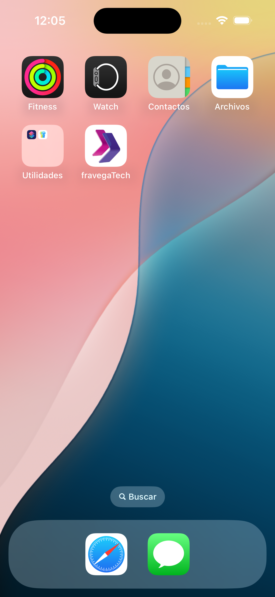
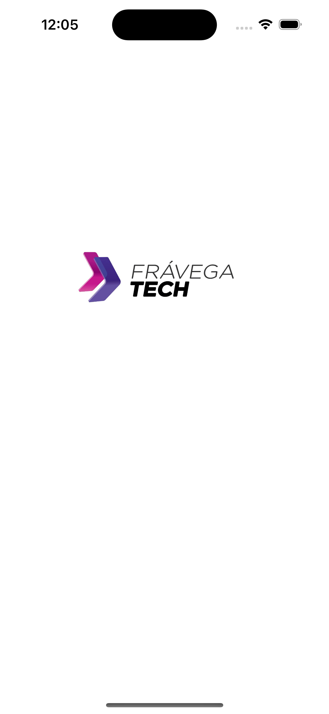
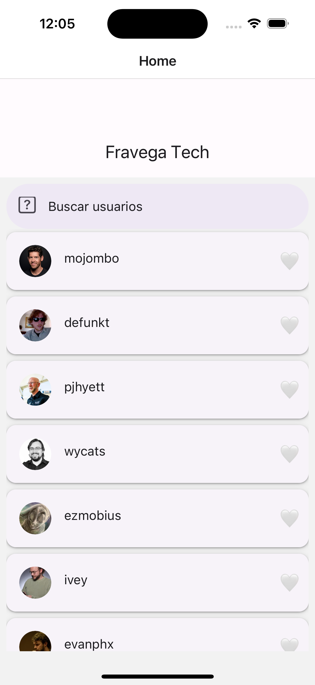
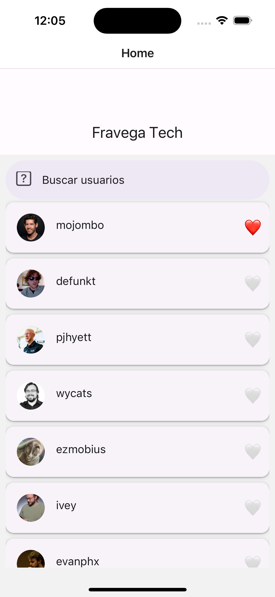
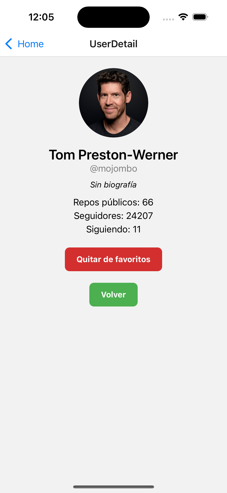
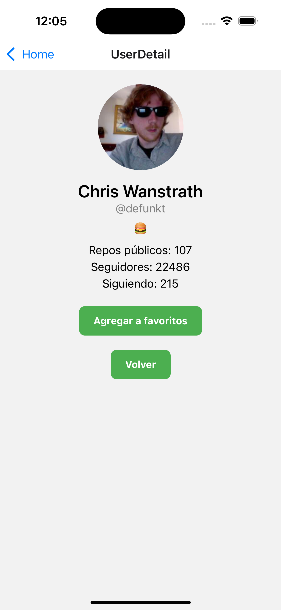

# Frávega Tech Challenge - Frontend Mobile

Este proyecto fue desarrollado como parte de un challenge técnico para el equipo de tecnología de **Frávega**, con foco en el desarrollo mobile utilizando **React Native**.

## 📱 Descripción

La aplicación permite visualizar una lista de usuarios de GitHub, buscar usuarios por nombre y marcar favoritos. También es posible acceder al detalle de cada usuario, visualizar información extendida y gestionar su estado de favorito. Toda la información es consumida directamente desde la API pública de GitHub.

---

## ✨ Funcionalidades

### 🔹 Pantalla de Inicio (Home)
- Muestra una lista inicial de usuarios obtenidos desde: `https://api.github.com/users`
- Permite buscar usuarios mediante la API: `https://api.github.com/search/users?q={term}`
- Opción para marcar y desmarcar usuarios como favoritos
- Favoritos mantenidos en memoria o en almacenamiento local (AsyncStorage)

### 🔹 Pantalla de Detalle del Usuario
- Visualización extendida de un usuario seleccionado, accediendo a:
  `https://api.github.com/users/{username}`
- Muestra avatar, nombre, bio, cantidad de repositorios, entre otros
- Alternar estado de favorito también desde esta pantalla

### 🔹 Estado Global y Navegación
- Se utiliza **React Navigation** para gestionar la navegación entre pantallas
- El estado de favoritos se maneja de forma global mediante **React Context**

---

## 🛠️ Tecnologías Utilizadas

- **React Native** `0.79.2`
- **React Navigation** (`@react-navigation/native`, `@react-navigation/native-stack`)
- **React Native Paper** para componentes visuales y UI
- **Context API** para manejo de estado global
- **Axios** o `fetch` para consumo de APIs (dependiendo de implementación final)
- **TypeScript** para tipado estático
- **ESLint + Prettier** para mantener calidad y formato de código

---

## ▶️ Instalación y Ejecución

- Clona el repositorio:

   ```bash
   git clone https://github.com/tu-usuario/fravega-tech-challenge.git
   cd fravega-tech-challenge

- Instala dependecias:

   ```bash
    npm install
    # o
    yarn install

- Levanta el proyecto an Android:

    ```bash
    npm run android

- Levanta el proyecto an IOS:

    ```bash
    npm run ios

---

## 🧑‍💻 Autor
Nombre: Ruben Dario Vega

Email: rubendariovega@gmail.com

GitHub: chufa1979

---
## 🎥 Vdeio Demo
Pueden observar la DEMO del proyecto 

https://youtube.com/shorts/Xy0S0lD5PLY?feature=share

---

## 📸 Capturas de Pantalla

### 🔹 Icono Instalado


### 🔹 SpashScreen


### 🔹 Listado del Usuario


### 🔹 Lista con Usuario Favorito


### 🔹 Detalle usuario seleccionado favorito


### 🔹 Detalle usuario sin seleccionado favorito


---
## 📄 Licencia
Este proyecto fue desarrollado únicamente con fines evaluativos para el proceso de selección técnica de Frávega. No posee fines comerciales.